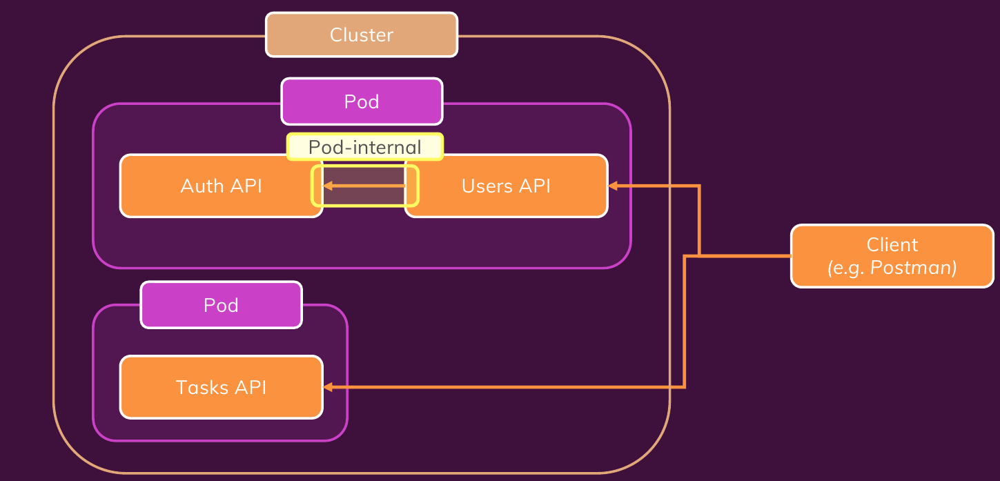
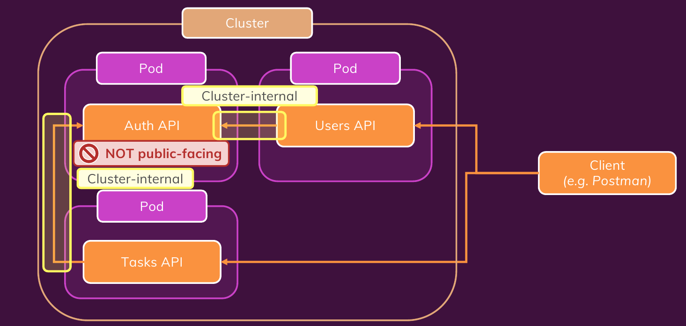

# K8S Max

# *Basics Concepts* 

## How to create Deployment

Normally you have config file that you will sent it to k8s cluster and k8s do every thing to make sure we will stay in that state 

```shell
kubectl get <deployments-services-pods># to get all the deployments services or pods 
```
```shell
kubectl delete deployment <deployment name> #to delete deployment
```
[reference docs for version 1.32](https://kubernetes.io/docs/reference/generated/kubernetes-api/v1.32/)

*deployment.yaml*

```yaml
apiVersion: apps/v1 # version of api 
kind: Deployment # could be service deployment, ... 
metadata: # in this part you will specify all metadata of your file 
  name: second-app-deployment # your deployment should have name see the original web site to see what you can put here 
  label: 
    group: example

spec: # here are all the configs that we want to have for deployment
  replicas: 1 # this one is the number of pod that we want to have if we put nothing the default will be 1 amount of traffic is important here 
  selector: # deployment is a dynamic object which means later when it is applied the number of pod could get changed but k8s should know which pods are controlled by this deployment. Thus, selectors are responsible for distinguishing all pods. 
    matchLabels:
      app: second-app # here we say all pods with label app= second-app nad tier = backend should be controlled by this deployment any other pod that has app=second-app but tier is not match or tier is backend but app in not match will not be controlled by this deployment 
      tier: backend
    
  # matchExpression: # the other method for selector that you can use for selector is expression that will match the label by some rules
  #   - {key: app, operator: In , values: [second-app, first-app]} # it simply says that select the labels that their key is app an their value is In the list [second-app, first-app] as you can see the operator here is In but the operators are limited you can see mor of them in original documentation but the first approach more common 
  template: # here we define which pods we want to create 
    metadata: # pod like deployment is another object and it should have metadata and you don't have to put a kind because k8s understand under a deployment we will put a pod 
      labels:
        app: second-app
        tier: backend
    spec: # this is the spec or config that we want to have for the pod  
      containers: # container settings 
        - name: second-node # name of the container
          image: academind/kub-first-app:2 # image that container should be create based on in the registry 

          livenessProbe: # k8s by it self check container healthy but we can tell it we want to have our method to check this container for example checking health route in backend in DCS
            httpGet: # send a get http request 
              path: /health # to path /health
              port: 8080 # port 8080
            periodSeconds: 10 # each 10 second 
            initialDelaySeconds: 5 # how long for the first time 

        # - name: you can create multi container using specify multi name and image 
        #   image: ...
```

now if you want to apply this file:

```shell 
~$kubectl apply -f=deployment.yaml 
```

## How to create Service 

*service.yaml*

```yaml
apiVersion: v1 # it is core so you don't have to put core/v1 just v1 is enough 
kind: Service
metadata:
  name: backend 
  label: 
    group: example  
spec:
  selector: # selector in deployment is a bit newer compare to service so 
  # deployment has multi option for select but service just has matchlabels so we don't mention it 
    app: second-app # imagine this scenario that you have another deployment that has some pod 
    # that their tier is different from above deployment pods but you want to select 
    # both of them and attach to this service. here we just have to specify the app:second-app
    # and all pods that has app:second-app labels will be selected 
  ports: # you can expose multiple ports (it is expose a port for pods)
    - protocol: 'TCP' #de
      port: 80 # you want expose 
      targetPort: 8080 # inside the container 
    # - protocol: 'TCP'
    #   port: 443
    #   targetPort: 443
  type: LoadBalancer # default is ClusterIP: internally exposed ip and only accessible inside 
  # of the cluster NodePort: expose on ip address of worker node and LoadBalancer that is the 
  # most common and is for exposing a node to the outside world so using cluster load balancer
  # you will get reachable IP address that gives you the access to the inside of cluster and pods 
```

to apply this service:

```shell
~$ kubectl apply -f service.yaml 
# and you can expose it using below command and see it in browser 
~$ minikube service backend # backend is the name of above service 
~$ kubectl delete -f=<.yaml file name> # delete service or deployment you can delete multi resource using multi -f=<.yaml file name>
~$ kubectl delete deployments,services -l group=example # you can also delete a resource using its labels and specify which resources  
```
 you can always change something in config.yaml and apply it again.
 you can put as much as resource definition that you want in one 
 file just you have to septate them using  <b>*---*</b> 3 dash  
 and a good practice is that if you want to put a service and deployment 
 in one file first define service.


# *Managing Data and Volume*

[<b>K8S volume reference</b>](https://kubernetes.io/docs/concepts/storage/volumes) types in the right sidebar 
___
There are 2 types of data in k8s user generated like account number phone number etc,... that persist volume 
is god for also. there are some application generated data or inter mediate data that pod level volume is god enough for them 
in k8s we call this data <b>*```state```*</b> 

k8s can mount a volume in to a container but the lifetime of the volume is depend on pod life time so it survive container restarts 
but it can not survive pod restart. there are a verity of volume type for local and cloud 

Project description 
we have node js application it has a post route for getting our data from text file that is empty at first and it has get route to write something in the file 

<b>*volumes are attached to pods and pods specific*</b> that is why we configure it in deployment in pod section 

<b>*master_config.yaml*</b>

```yaml

apiVersion: v1
kind: Service
metadata:
  name: story-service
spec:
  selector: 
    app: story
  type: LoadBalancer
  ports:
    - protocol: "TCP"
      port: 80
      targetPort: 3000

---

apiVersion: apps/v1
kind: Deployment
metadata:
  name: story-deployment
spec: 
  replicas: 1
  selector:
    matchLabels:
      app: story
  template:
    metadata:
      labels:
        app: story
    spec:
      containers: # you can have a list of container below with the name and its image
        - name: story
          image: academind/kub-data-demo # remember this image supposed to be built and sent to any container registry 
          volumeMounts: #  as soon as you define a volume you can attach that volume to your container (again it is a list means you can attach multiple volume to your container)
            - mountPath: /app/story # this is the internal path that you want to mount
              name: empty-dir # since you can have multiple volume you should mention the volume name for clarification that which volume or volumes are attached to this container
      volumes: # again like the container it is a list that you can specify the name and the type here are emptyDir rest of the types are in original documentation 
        - name: empty-dir 
          emptyDir: {} # it always creates a new empty directory when pods starts and keeps it alive and filled with data as long as pod alive if pod removed it would be removed 
        - name: host-path
          hostPath: # here we have some configuration and it is more like bind mount in docker volume that you bind an address from hist machine to the docker 
            path: /data
            type: DirectoryOrCreate # means /data is a directory and if it is not exist create it there if you put Directory if /data is not there it will failed 
````
____
* one problem with emptyDir is if you create 2 replica of a pod and save some data in it if one 
replica is crashed that data is not available and data in second replica is available becaus the 
traffic is routed in the other pod now

* one way is use another type like hostPath it allows you to mounts a file or directory from 
the host node's into your pod means multiple pods can now share the same path on teh host machine 
instead of pods specific path

* again the downside of hostPath is if you have a bigger cluster with multiple node(node means 
machine that hosts the pods)it will fail again because one node does not have access to another node 

* there is a really important type named csi that is a interface and you can create your own type 
using that we will see it in action later in AWS part  
___

## persist volumes 

last two volume are depend or exist on a node or pod but here we want to separate volume from the 
node and pod  and create new entity and each node wants it should <b>*```claim```*</b> it  


<b>*host-pv.yaml*</b>


```yaml
apiVersion: v1
kind: PersistentVolume # make sure there is no type 
metadata:
  name: host-pv
spec:
  capacity: # the other pods will claim this volume but they claim a part of this capacity
    storage: 4Gi # define how much space it has 
  volumeMode: Filesystem # the other option is block you can read more about difference between FileSystem and block 
  storageClassName: standard # default in minikube
  accessModes: # define the wey of access an it is a list means that we can have multi kind of access 
    - ReadWriteOnce # this means this volume can be claim by single node (multi pod but single node)  
    # there are also other options like ReadOnlyMany means read only but can be claim by multi node and ReadWriteMany means
    # read write by many but it is obvious that for hostPath these two are not options   
  hostPath: # again it is node dependent because it is a hostPath
    path: /data
    type: DirectoryOrCreate
```

now that we create the volume we should create claim for 

<b>*host-pvc.yaml*</b>

```yaml
apiVersion: v1
kind: PersistentVolumeClaim # make sure there is no typo 
metadata:
  name: host-pvc
spec: # now we should claim that persist volume note that you can make a claim for multiple persist volume  
  volumeName: host-pv # claim by the name is not the only option for example you can say I want the volume 
  # with that specific capacity and lots of other options that you can see in the original documentation 
  accessModes: # define the way of access 
    - ReadWriteOnce
  storageClassName: standard
  resources: # it is kind of the counterpart of the capacity in the persist volume 
    requests: 
      storage: 1Gi # max is 4 cuz just 4 Gi is available 
```
<b>*```storageClassName should be more investigated =```*</b>

now we should connect the volume to the pods that we want just one more thing we can pass our 
$environmental$ $variables$ with two method 

---
1- pass them as name value in deployment to our container 

2- create ConfigMap for it like below  

---
<b>*environment.yaml*</b>

```yaml
apiVersion: v1
kind: ConfigMap
metadata:
  name: data-store-env
data:
  folder: 'story'
  # key: value..
```


<b>*deployment.yaml*</b>

```yaml
apiVersion: apps/v1
kind: Deployment
metadata:
  name: story-deployment
spec: 
  replicas: 2
  selector:
    matchLabels:
      app: story
  template:
    metadata:
      labels:
        app: story
    spec:
      containers:
        - name: story
          image: academind/kub-data-demo:2
          env: # you can also define a list of env vars here that your container can utilize 
            - name: STORY_FOLDER # it is the env var name
              value: 'story' # it is the env var value 
              valueFrom: 
                configMapKeyRef: # for pulling from the config map you still have the name of that env var "STORY_FOLDER" but below you will say that the value of this env var comes from the key that I will say   
                  name: data-store-env # name of the config map 
                  key: folder # it says go and find the key in config map with the name of folder and bring me its value and assign it to STORY_FOLDER var
          volumeMounts: # bind mount is just like before but now it is independent from pods 
            - mountPath: /app/story
              name: story-volume
      volumes: 
        - name: story-volume # again give it a name 
          persistentVolumeClaim: 
            claimName: host-pvc # and we should say which claim is target claim here 
```


# K8S Networking

## $Scenario$ $One$

this is the scenario that we are fallow for now there are to container in one pod
and one in one pod and both accessible by client in outside 
 


create deployment for user

<b>*user-deployment.yaml*</b>

```yaml
apiVersion: apps/v1
kind: Deployment
metadata:
  name: users-deployment
spec:
  replicas: 1
  selector: 
    matchLabels:
      app: users
  template:
    metadata:
      labels:
        app: users
    spec:
      containers: # as you can see there are 2 images and for each in the same deployment means 2 container in one pod 
        - name: users
          image: academind/kub-demo-users:latest
          env: # when 2 container are in the same pod the can call each 
          # other api using localhost so we pass localhost as AUTH_ADDRESS 
          # to user container and it is going to be the address of auth 
          # container for users 
            - name: AUTH_ADDRESS
              value: localhost
        - name: auth
          image: academind/kub-demo-auth:latest

```

create service to make connection between user pod and outside world 

<b>*user-service.yaml*</b>

```yaml
apiVersion: v1
kind: Service
metadata:
  name: users-service
spec:
  selector:
    app: users
  type: LoadBalancer
  ports:
    - protocol: TCP
      port: 8080 # this one could be any acceptable port it is a port that we expose 
      targetPort: 8080 # remember this ones is for container you can not change it 
```

if two container are in the same pod you can send request between them by <b>*```localhost```*</b>

## $Scenario$ $Two$

in second scenario we want to make sure that auth api is not accessible from outside
so we put every container in a separate pod and expose task and users pod to outside
and auth pod just internally



create deployment and service for user 

<b>*user.yaml*</b>

```yaml
apiVersion: v1
kind: Service
metadata:
  name: users-service
spec:
  selector:
    app: users
  type: LoadBalancer # user will be expose external
  ports:
    - protocol: TCP
      port: 8080
      targetPort: 8080

---

apiVersion: apps/v1
kind: Deployment
metadata:
  name: users-deployment
spec:
  replicas: 1
  selector: 
    matchLabels:
      app: users
  template:
    metadata:
      labels:
        app: users
    spec:
      containers:
        - name: users
          image: academind/kub-demo-users:latest
          env:
            - name: AUTH_ADDRESS
              # value: "10.99.104.252"
              value: "auth-service.default"

```
___
create deployment and service for auth

<b>*auth.yaml*</b>

```yaml
apiVersion: v1
kind: Service
metadata:
  name: auth-service
spec:
  selector:
    app: auth
  type: ClusterIP # it is supposed to be exposed just internal 
  ports:
    - protocol: TCP
      port: 80
      targetPort: 80

---

apiVersion: apps/v1
kind: Deployment
metadata:
  name: auth-deployment
spec:
  replicas: 1
  selector: 
    matchLabels:
      app: auth
  template:
    metadata:
      labels:
        app: auth
    spec:
      containers:
        - name: auth
          image: academind/kub-demo-auth:latest

```

what is the ip address of this service because we want to call it 
using user and task so one way is apply this service and using 
kubectl get services see its address and fill ```AUTH_ADDRESS``` 
env var value with it the good news is it is fixed and we can do it 
but it is a bit annoying a better 
ways are:

1- there are some generated env vars that k8s generate automatically and the
convention is like this ```<name of the service all upper and - to _>_SERVICE_HOST```
for example if you want to call auth api from user it would be 
<b>AUTH_SERVICE_SERVICE_HOST</b> or if from auth you want to call users
it would be <b>USERS_SERVICE_SERVICE_HOST</b> and remember it is an env var 
and you can get its value right in your all you don't have to get it
yaml file 

2- there is a *```Core DNS```* inside of k8s that specify a dns to internal services and 
it is just simply the name of that service that we want to send a request to and a dot 
and name space that here is default you can pass it as env var to your docker container and 
use it as dns   

___
create deployment and service for task
<b>*task.yaml*</b>

```yaml
apiVersion: v1
kind: Service
metadata:
  name: tasks-service
spec:
  selector:
    app: tasks
  type: LoadBalancer # supposed to be exposed to client 
  ports:
    - protocol: TCP
      port: 8000
      targetPort: 8000

---

apiVersion: apps/v1
kind: Deployment
metadata:
  name: tasks-deployment
spec:
  replicas: 1
  selector: 
    matchLabels:
      app: tasks
  template:
    metadata:
      labels:
        app: tasks
    spec:
      containers:
        - name: tasks
          image: academind/kub-demo-tasks:latest
          env:
            - name: AUTH_ADDRESS
              # value: "10.99.104.252"
              value: "auth-service.default"
            - name: TASKS_FOLDER
              value: tasks
```
so we saw 3 way of making connection between two internal pod and the last one (the one that utilize 
DNS address) is more common and also 2 approach (3 pod and 2 pod) that normally the second approach 
is better meaning having one pod for each image. 
video 14 reverse proxy


# Deploy On EKS

for initialization some works should be done:

1- choose container registry and create images and push there

2- create mongo atlas account and get connection string  